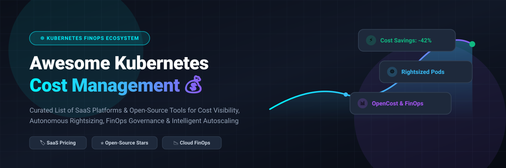

# ☸️ Awesome Kubernetes Cost Management 💰



<div align="center">

<a href="https://github.com/ishandutta2007/Awesome-Awesome-Awesome"></a><a href="https://discord.gg/jc4xtF58Ve"></a>
[](LICENSE)
[](https://github.com/ishandutta2007/Awesome-Kubernetes-Cost-Management/pulls)
[](https://kubernetes.io/)
<a href="https://github.com/ishandutta2007"></a>

**A curated, SEO-optimized list of top SaaS platforms and Open-Source projects for Kubernetes Cost Management, FinOps, Resource Rightsizing, Cloud Spend Optimization, and Intelligent Cluster Autoscaling.**

*Last updated: September 2026* 📅

</div>

---

## 📌 Table of Contents

- [🧠 Overview & FinOps Principles](#-overview--finops-principles)
- [🏢 SaaS & Commercial Platforms](#-saas--commercial-platforms)
- [🔓 Open-Source GitHub Projects](#-open-source-github-projects)
- [🛠️ Architectural Recommendations & Toolchains](#%EF%B8%8F-architectural-recommendations--toolchains)
- [🤝 How to Contribute](#-how-to-contribute)
- [💖 Support & Community](#-support--community)
- [📈 Star History](#-star-history)
- [⚠️ Disclaimer](#%EF%B8%8F-disclaimer)

---

## 🧠 Overview & FinOps Principles

As Kubernetes workloads scale across AWS (EKS), GCP (GKE), Azure (AKS), and on-premises clusters, managing cloud infrastructure spend becomes a critical DevOps and platform engineering discipline. **Kubernetes Cost Management** addresses idle node capacity, over-provisioned CPU/memory resource requests, unallocated pod costs, and complex multi-tenant billing allocation.

This repository categorizes both commercial SaaS platforms and community-driven open-source projects designed to:
- 📊 **Track & Allocate Spend:** Breakdown costs by namespace, deployment, pod, service, label, or custom unit economics.
- 🎯 **Rightsize Workloads:** Recommend or automatically apply optimal CPU/RAM requests and limits.
- ⚡ **Automate Autoscaling & Spot Usage:** Provision right-sized nodes on-demand using Karpenter/KEDA and leverage spot instance stability.
- 🏷️ **Prevent Cloud Waste:** Scale non-production environments down to zero during off-hours.

---

## 🏢 SaaS & Commercial Platforms

📊 **Market Size & Industry Dynamics:** The Global Cloud & Kubernetes Cost Management (FinOps) market is estimated at **$12.8 Billion in 2026** (growing at a 22.4% CAGR). The market is **moderately fragmented**, undergoing rapid consolidation as enterprise infrastructure giants (IBM/Apptio, NetApp, Harness) acquire category pioneers while specialized AI-driven autonomous optimization startups (Cast AI, ScaleOps, CloudZero) capture rapid market share.

Below is a curated comparison of leading commercial SaaS platforms, sorted by estimated **Company Size / Valuation (Descending)**:

| SaaS Product 🚀 | Company Size / Valuation 🏢 | Starting Price 💵 | Free Tier / Trial Limits 🎁 | Key Features & Focus 🎯 |
| :--- | :--- | :--- | :--- | :--- |
| **[Kubecost (IBM / Apptio)](https://www.kubecost.com/)** | **$4.6B+** *(Acquired by IBM/Apptio)* | $499 / month *(Business Tier)* | **Free Forever** *(Unlimited clusters up to 250 cores, 15-day metric retention)* | Real-time K8s cost allocation built on OpenCost, multi-cluster aggregation, enterprise bill reconciliation, and out-of-the-box Grafana dashboards. |
| **[Harness CCM](https://harness.io/products/cloud-cost/)** | **$3.7B** *(Series D Valuation)* | $2.50 per $1k monitored spend *($100/mo min)* | **Free Tier Forever** *(Up to $250k annual cloud spend monitored)* | FinOps module integrated into Harness CI/CD. Autostopping for idle non-prod workloads, cost anomaly detection, and governance. |
| **[Spot Ocean (NetApp)](https://spot.io/products/ocean/)** | **$20B+** *(NetApp Market Cap)* | $0.08 / managed compute hour *(or 20% savings share)* | **14-Day Free Trial** *(Unlimited node management during trial)* | Serverless container infrastructure engine. Automates cluster bin-packing, dynamic node sizing, and spot instance fallback without downtime. |
| **[Cast AI](https://cast.ai/)** | **$250M+** *($73M total funding)* | $0.0035 / node hour optimized *(or 25% savings share)* | **Free Forever** *(Read-only cost auditing & visibility); 14-day autonomous trial* | Autonomous Kubernetes cost optimization. Live re-binpacking, instant node replacement, automated rightsizing, and spot interruption handling. |
| **[CloudZero](https://www.cloudzero.com/)** | **$150M+** *($52M total funding)* | $1,200 / month *(Minimum annual contract)* | **30-Day Free POC** *(Full feature enterprise evaluation)* | FinOps & unit-economics platform mapping Kubernetes pod metrics to customer, feature, and product unit costs alongside AWS/GCP/Snowflake spend. |
| **[Densify](https://www.densify.com/)** | **$100M+** *(Enterprise Revenue Scale)* | $15 / node / month *($180/node/yr)* | **14-Day Free Trial** *(Up to 500 node analysis)* | Machine-learning container & VM optimization engine analyzing workload patterns to prevent performance risk while reducing node count. |
| **[StormForge](https://www.stormforge.io/)** | **$80M+** *($19M funding)* | $10 / cluster node / month | **Free Tier Forever** *(1 cluster up to 15 pods)* | Machine learning-driven rightsizing for CPU/RAM requests. Integrates directly with Karpenter, HPA, VPA, and GitOps pipelines. |
| **[Fairwinds Insights](https://www.fairwinds.com/insights)** | **$60M+** *($15M funding)* | $250 / month *(Team Plan up to 20 nodes)* | **Free Tier Forever** *(2 clusters up to 50 workloads)* | Unified Kubernetes governance platform combining cost rightsizing recommendations with OPA policy enforcement, security vulnerability scanning, and CVE auditing. |
| **[Vantage](https://www.vantage.sh/)** | **$50M+** *($21M funding)* | $30 / month *(Pro plan up to $10k monthly spend)* | **Free Tier Forever** *(Up to $2,500 monthly tracked cloud spend)* | Modern developer-centric cloud cost visibility platform featuring Kubernetes virtual tagging, cross-cloud dashboards, and cost anomaly alerts. |
| **[ScaleOps](https://scaleops.com/)** | **$40M+** *($21M Series A)* | $0.004 / container hour managed | **30-Day Free Trial** *(Unlimited nodes & workloads)* | Fully automated runtime container resource management. Continuously adjusts memory & CPU requests in real-time according to live traffic demands. |
| **[PerfectScale](https://www.perfectscale.io/)** | **$30M+** *($9.5M funding)* | $7 / node / month | **30-Day Free Trial** *(Up to 100 nodes evaluated)* | Intent-aware Kubernetes rightsizing platform balancing cost efficiency against SLO/SLA reliability and workload criticality. |
| **[nOps](https://www.nops.io/)** | **$25M+** *($10M Series A)* | 15% of verified savings generated | **14-Day Free Trial** *(Complete AWS & EKS cluster spend audit)* | AWS-focused FinOps automation engine managing EKS commitment models, spot instance scheduling, and automated pod resource rightsizing. |

---

## 🔓 Open-Source GitHub Projects

Below is an extensive collection of open-source Kubernetes cost monitoring, autoscaling, and rightsizing tools, sorted by **GitHub_Stars_Count (Descending)**. Each Stars_Badge links directly to the stargazers page of that repository.

| Open-Source Project 🛠️ | GitHub_Stars_Count ⭐ | Primary Focus 🎯 | License 📜 | Description 📝 |
| :--- | :--- | :--- | :--- | :--- |
| **[KEDA](https://github.com/kedacore/keda)** | [](https://github.com/kedacore/keda/stargazers) | Event-Driven Autoscaling | Apache-2.0 | Kubernetes Event-driven Autoscaling component that scales workloads down to 0 based on external metrics (Kafka, SQS, Prometheus, Redis). |
| **[Cloud Custodian](https://github.com/cloud-custodian/cloud-custodian)** | [](https://github.com/cloud-custodian/cloud-custodian/stargazers) | Cloud & K8s Governance | Apache-2.0 | CNCF Incubating rule engine using simple YAML policies to manage cloud resources, enforce off-hours power schedules, and clean up idle assets. |
| **[Steampipe](https://github.com/turbot/steampipe)** | [](https://github.com/turbot/steampipe/stargazers) | SQL Cloud/K8s Querying | AGPL-3.0 | Query live cloud and Kubernetes APIs using standard SQL to audit underutilized nodes, unattached persistent volumes, and idle resources. |
| **[Karpenter](https://github.com/kubernetes-sigs/karpenter)** | [](https://github.com/kubernetes-sigs/karpenter/stargazers) | Intelligent Node Provisioning | Apache-2.0 | CNCF Kubernetes node autoscaler that rapidly provisions right-sized EC2/Compute nodes based on unschedulable pods and aggressively consolidates idle capacity. |
| **[OpenCost](https://github.com/opencost/opencost)** | [](https://github.com/opencost/opencost/stargazers) | Real-Time Cost Allocation | Apache-2.0 | CNCF Incubating project for real-time Kubernetes cost monitoring & allocation across CPU, GPU, RAM, network, and storage across AWS, Azure, GCP, and on-prem. |
| **[Crane](https://github.com/gocrane/crane)** | [](https://github.com/gocrane/crane/stargazers) | FinOps & Analytics Engine | Apache-2.0 | FinOps platform by FinOps Foundation for cloud native stack optimization, including time-series prediction, workload scheduling, and cost visibility (Fadvisor). |
| **[Robusta](https://github.com/robusta-dev/robusta)** | [](https://github.com/robusta-dev/robusta/stargazers) | K8s Observability & Alerts | MIT | Open-source Kubernetes automation platform that provides multi-cluster cost troubleshooting, Prometheus alert enrichment, and resource tracking. |
| **[Goldilocks](https://github.com/fairwindsops/goldilocks)** | [](https://github.com/fairwindsops/goldilocks/stargazers) | VPA Resource Recommender | Apache-2.0 | Utility that creates Vertical Pod Autoscaler (VPA) recommendations for workloads and presents a clean visual dashboard for tuning pod CPU/RAM. |
| **[Komiser](https://github.com/tailwarden/komiser)** | [](https://github.com/tailwarden/komiser/stargazers) | Multi-Cloud Resource Audit | Apache-2.0 | Open-source cloud environment scanner that uncovers unused resources, misconfigurations, and hidden cost drivers across AWS, GCP, Azure, and K8s. |
| **[Kubecost cost-model](https://github.com/kubecost/cost-model)** | [](https://github.com/kubecost/cost-model/stargazers) | K8s Allocation Model Engine | Apache-2.0 | Core calculations engine powering OpenCost and Kubecost for multi-cloud node pricing, persistent volume tracking, and pod cost allocation calculations. |
| **[OptScale](https://github.com/Harness/optscale)** | [](https://github.com/Harness/optscale/stargazers) | Open FinOps & MLOps Costing | Apache-2.0 | FinOps platform for tracking infrastructure spend, detecting anomalies, managing budgets, and optimizing ML/K8s cluster utilization. |
| **[KubeSurvival](https://github.com/kubesurvival/kubesurvival)** | [](https://github.com/kubesurvival/kubesurvival/stargazers) | Optimal Node Sizing | MIT | CLI tool that analyzes all pods running in your Kubernetes cluster and calculates the exact cheapest cloud machine types required to support them. |
| **[Wozz](https://github.com/wozz-io/wozz)** | [](https://github.com/wozz-io/wozz/stargazers) | Agentless K8s Cost Auditor | MIT | Lightweight agentless CLI tool that executes locally using existing `kubectl` context to audit cluster resource waste against cloud list prices. |
| **[Kubefin](https://github.com/kubefin/kubefin)** | [](https://github.com/kubefin/kubefin/stargazers) | Unified Multi-Cluster FinOps | Apache-2.0 | CNCF-aligned cost monitoring and allocation system providing multi-cloud and multi-cluster spend transparency. |
| **[Koku](https://github.com/project-koku/koku)** | [](https://github.com/project-koku/koku/stargazers) | Hybrid Cloud Cost Reporting | Apache-2.0 | Open-source cost management engine maintained for processing billing reports across AWS, Azure, GCP, and OpenShift/Kubernetes clusters. |
| **[Kubeidle](https://github.com/kubeidle/kubeidle)** | [](https://github.com/kubeidle/kubeidle/stargazers) | Off-Hours Workload Scaler | MIT | Operator to scale down non-production Kubernetes deployments to 0 replicas during nights and weekends to eliminate idle cluster costs. |
| **[Terracost](https://github.com/cycloidio/terracost)** | [](https://github.com/cycloidio/terracost/stargazers) | Terraform Plan Cost Estimator | MIT | Open-source engine to parse Terraform plans and extract estimated monthly cloud costs before infrastructure deployment. |
| **[Cloudelephant](https://github.com/cloudelephant/cloudelephant)** | [](https://github.com/cloudelephant/cloudelephant/stargazers) | Cloud Idle Asset Finder | Apache-2.0 | Scans cloud subscriptions to detect orphaned disks, unattached Elastic IPs, and underutilized Kubernetes worker nodes. |

---

## 🛠️ Architectural Recommendations & Toolchains

Building a production-ready Kubernetes FinOps stack depends on your organization's security boundaries, cloud scale, and automation maturity:

```
                  ┌─────────────────────────────────────────┐
                  │          Kubernetes Workloads           │
                  └────────────────────┬────────────────────┘
                                       │
                ┌──────────────────────┴──────────────────────┐
                ▼                                             ▼
  ┌──────────────────────────┐                  ┌──────────────────────────┐
  │  Cost Allocation Engine  │                  │  Intelligent Autoscaling │
  │  (OpenCost / Kubecost)   │                  │  (Karpenter / KEDA / VPA)│
  └─────────────┬────────────┘                  └─────────────┬────────────┘
                │                                             │
                ▼                                             ▼
  ┌──────────────────────────┐                  ┌──────────────────────────┐
  │ Metrics & Visualization  │                  │ Off-Hours & Rightsizing  │
  │ (Prometheus + Grafana)   │                  │ (Goldilocks / Kubeidle)  │
  └──────────────────────────┘                  └──────────────────────────┘
```

1. **Lightweight / Agentless Starting Point:** Use **[Wozz](https://github.com/wozz-io/wozz)** or **[KubeSurvival](https://github.com/kubesurvival/kubesurvival)** for instant local CLI audits without deploying in-cluster pods or metric pipelines.
2. **Production Cost Transparency:** Deploy **[OpenCost](https://github.com/opencost/opencost)** paired with Prometheus & Grafana to establish real-time per-namespace and per-pod cost allocation dashboards.
3. **Automated Provisioning & Rightsizing:** Pair **[Karpenter](https://github.com/kubernetes-sigs/karpenter)** (node consolidation) with **[Goldilocks](https://github.com/fairwindsops/goldilocks)** / **[StormForge](https://www.stormforge.io/)** (request tuning) and **[KEDA](https://github.com/kedacore/keda)** (event-driven scaling to zero).
4. **Enterprise Multi-Cloud SaaS:** Evaluate **[Kubecost Enterprise](https://www.kubecost.com/)**, **[Cast AI](https://cast.ai/)**, or **[Harness CCM](https://harness.io/)** when requiring automated spot management, enterprise discount reconciliation, or custom SLA/SLO intent rules.

---

## 🤝 How to Contribute

Contributions are highly encouraged! To keep this repository accurate, neutral, and valuable for the DevOps & FinOps community, please follow these guidelines:

1. **Fork this repository** 🍴
2. **Create a new branch** (`git checkout -b feature/add-tool`)
3. **Follow the existing table formats**:
   - For **SaaS**: Include product name, estimated company size/valuation, specific starting price, specific free tier/trial limit, and description.
   - For **Open-Source**: Include repository name, Stars_Count badge linking to `stargazers`, focus area, license, and concise description.
4. **Ensure links are direct & functional**.
5. **Submit a Pull Request** 🚀 with a brief summary of the added tool.

Check out [Awesome-Awesome-Awesome](https://github.com/ishandutta2007/Awesome-Awesome-Awesome) for more curated lists!

---

## 💖 Support & Community

Thank you for visiting **Awesome Kubernetes Cost Management**! If this repository has helped your engineering team reduce cloud spend, rightsize workloads, or navigate the FinOps ecosystem, please consider supporting the project:

- 🌟 **Star this repository** to help other platform engineers discover it!
- 🔀 **Fork & Contribute** to expand the list of open-source and commercial tooling.
- 📢 **Share** with your DevOps, SRE, and FinOps communities.
- ☕ **Sponsor / Buy me a coffee**: Support ongoing updates via [GitHub Sponsors](https://github.com/sponsors/ishandutta2007).

---

## 📈 Star History

[](https://star-history.dera.page/#ishandutta2007/Awesome-Kubernetes-Cost-Management&type=date&legend=top-left)

---

## ⚠️ Disclaimer

- This repository is a community-curated collection intended for educational and informational purposes. It does not constitute an explicit endorsement of any commercial platform or open-source software.
- Cloud pricing, cloud provider list prices, and vendor plans change frequently. Always verify pricing structures directly on official vendor documentation.
- Note that running open-source metric collection stacks (e.g., Prometheus, Thanos, OpenCost) incurs computational overhead and engineering maintenance costs — evaluate the total cost of ownership (TCO) when choosing between self-hosted and SaaS solutions.

<div align="center">
  <sub>Made with ❤️ by platform engineers, for platform engineers.</sub>
</div>
